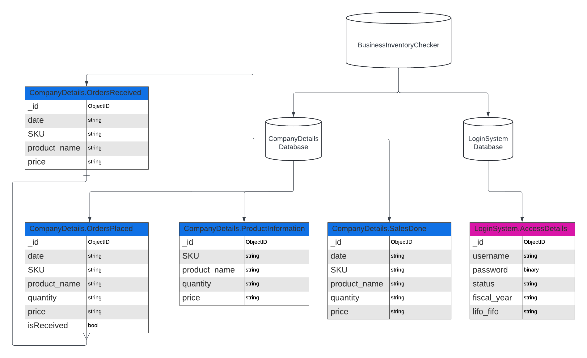
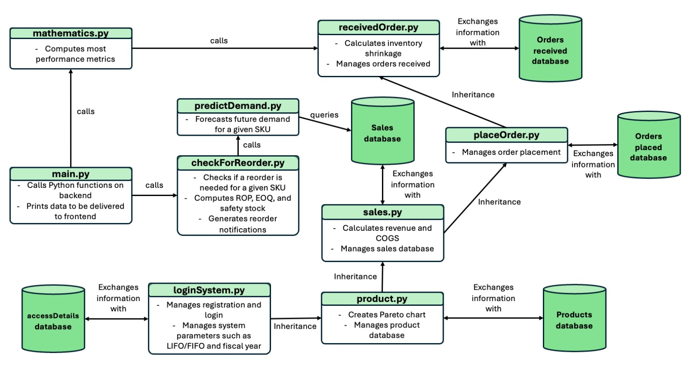

<h1 align="center"> Inventory Optimizer </h1>
<p align="center">
</img></img>
</p>

<p align="center">
</img> </img> </img> </img> </img> </img> 
</p><p align="center">
</img>
</img>
</img> </img> </img> </img>
</p>

---
### Project Description 📌
<p align="center">
</img></img>
</p>

---
### Developers 🎓
- This project was developed by a group of Boston University College of Engineering students: Vugar Amirov (Computer Engineering (B.S.)), Zhakhangir Mamayev (Computer Engineering (B.S.)), Pree Simphliphan (Computer Engineering (B.S.)), Rawisara Chairat (Computer Engineering (B.S.)), and Cole Shaigec (Electrical and Computer Engineering (M.S.))
---
### Tech Stack ⚙️
- Python (3.9 or newer)
- HTML, CSS, JavaScript
- npm, pip
- MongoDB
- Frontend framework: Nodejs, Electronjs, Bootstrap 
- Python Libraries: pymongo, bcrypt, scipy, numpy, pandas, statsmodels, matplotlib, bson.json_util, abc_classification 
---
### Dependencies Installation [Required if not installed] 🗝️
- Install [Python](https://www.python.org/downloads/), [npm](https://docs.npmjs.com/downloading-and-installing-node-js-and-npm) and [pip](https://pip.pypa.io/en/stable/installation/) in your local machine, check if it's installed in your machine by
   ```bash
   python3 --version
   ```
   ```bash
   npm --version
   ```
   ```bash
   pip -version
   ```
- Run this command line in terminal to install every package
   ```bash
   pip install pymongo bcrypt scipy numpy pandas statsmodels matplotlib bson.json_util abc_classification
   ```
   ```bash
   pip install --upgrade pymongo bcrypt scipy numpy pandas statsmodels matplotlib bson.json_util abc_classification
   ```
- (alternative option) virtual environment if you wouldn't like to install all packages in your computer
   1. Change directory to your repo
      ```bash
      cd Desktop/Inventory_Optimizer
      ```
   2. Setup Python virtual environment
      ```bash
      python3 -m venv .venv
      ```
   3. Change all the python path in each child_process spawn to your .venv path
   4. Before beginning any process, activate your virtual environment inside your repo
      ```bash
      source .venv/bin/activate
      ```
   5. Install all dependencies
      ```bash
      python3 -m pip install pymongo bcrypt scipy numpy pandas statsmodels matplotlib bson.json_util abc_classification
      ```
      ```bash
      python3 -m pip install --upgrade pymongo bcrypt scipy numpy pandas statsmodels matplotlib bson.json_util abc_classification
      ```
   6. Deactivate once you finish running/using the application
      ```bash
      deactivate
      ```
---
### How to Use This Product + Features (Demo Video) 💻
---
### How to Install and Run This Project 🔑
1. Clone this repository
   Using HTTPs
   ```bash
   cd Desktop
   git clone https://github.com/dzokha-true/Inventory_Optimizer.git
   ```
   Using SSH
   ```bash
   git clone git@github.com:dzokha-true/Inventory_Optimizer.git
   ```
2. Go to github repository on your local machine
   ```bash
   cd Desktop/Inventory_Optimizer
   ```
   Depends on where your are at
3. Install Electronjs in your repo
   ```bash
   npm install --save-dev electron
   ```
   No need to initialize config since the package.json has already been included in this repository
4. Install Nodejs in your repo
   ```bash
   pip install nodejs
   ```
5. Run npm start to run the program
   ```bash
   npm start
   ```
---
### Software Architecture 🖥️
<p align="center"></img> Database Schema </p>
<p align="center"></img> Frontend </p>
<p align="center"></img> Backend </p>
---
### Contribution 💼
- This project is an open source. If you would like to contribute to the project and develop this desktop application for your organization, please reach out to us!
---
### Reference (Link) 📄
<details>
<summary>Badge</summary>
   
[example badge](https://github.com/alexandresanlim/Badges4-README.md-Profile)
</details>
<details>
<summary>MongoDB</summary>
   
[MongoDB](https://www.mongodb.com/docs/)
</details>
<details>
<summary><text>Frontend</text></summary>
   
[Electronjs](https://www.electronjs.org/docs/latest)
   
[Nodejs](https://nodejs.org/docs/latest/api/child_process.html)

[Bootstrap](https://getbootstrap.com/docs/3.4/getting-started/)

[Navigation Bar](https://codepen.io/areal_alien/pen/BaRpxdX)

[Product Form](https://codepen.io/rickyeckhardt/pen/oNXeoZp)

[Notification](https://www.frontendmentor.io/solutions/notification-page-using-html-css-and-javascript-K9FU7V5Hox)

[Graphics Logo](https://spline.design/)
</details>
<details>
<summary>Backend</summary>

[Numpy](https://numpy.org/doc/)

[Pandas](https://pandas.pydata.org/docs/)

[Scipy](https://docs.scipy.org/doc/scipy/)

[Matplotlib](https://matplotlib.org/stable/index.html)

[bcrypt](https://pypi.org/project/bcrypt/)

[pymongo](https://pymongo.readthedocs.io/en/stable/)

[abc_classification](https://pypi.org/project/abc-classification/)

[statsmodels](https://pypi.org/project/statsmodels/)

[bson.json_util](https://pymongo.readthedocs.io/en/stable/api/bson/json_util.html)
</details>
